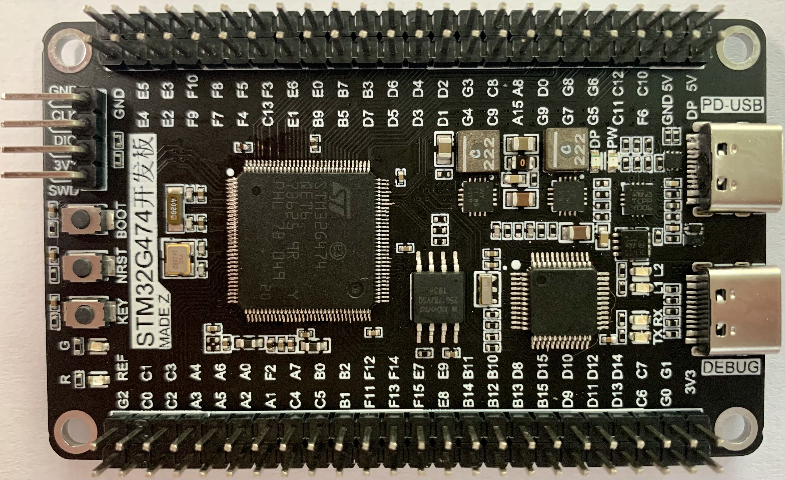

# STM32G474开发板
## 板载资源
> 板载DAP下载器，无需连接外部下载器，单板可实现调试

> SWD接口引出，可以断开板载DAP下载器，方便外置下载器下载程序

> 板载PD模块，参考ST官方的PD设计，适用于开发PD接口

> QSPI-Flash模块，可以焊接W25Q64/128/80/32等型号Flash

> 一颗红色LED，一颗绿色LED，一颗用户按键

> IO接口全部引出（QSPI、USB、SWD通过功能接口引出）

## 开发板外形

>两个Type-C接口分别连接DAP下载器、STM32G474的USB-PD

## SDK资源
正在编写该开发板的QSPI、PD、GPIO、PWM等例程。也欢迎贡献G4系列的例程